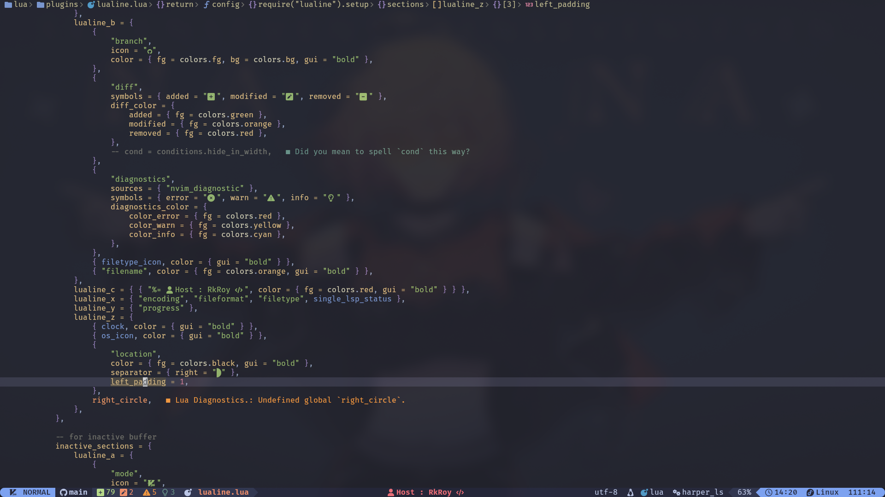
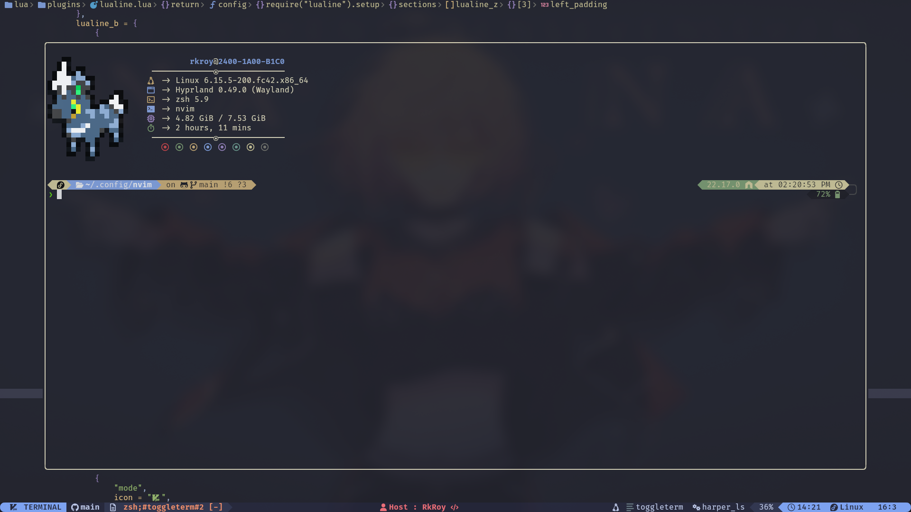
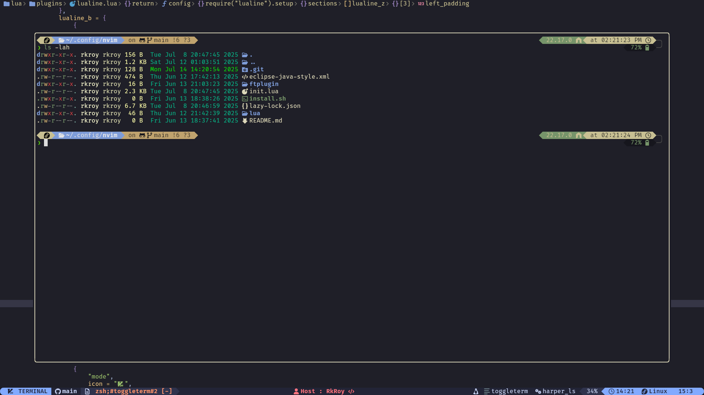
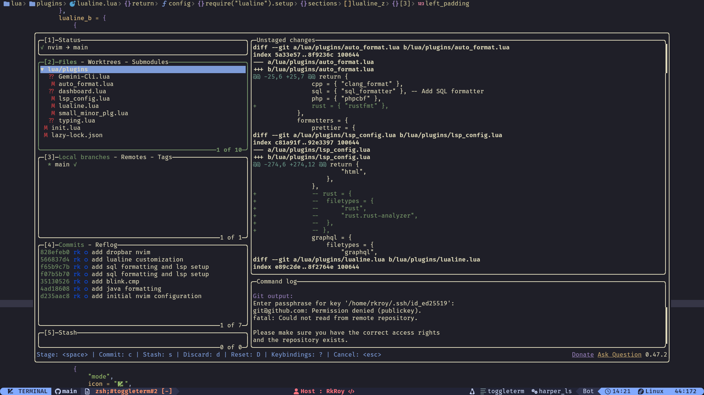
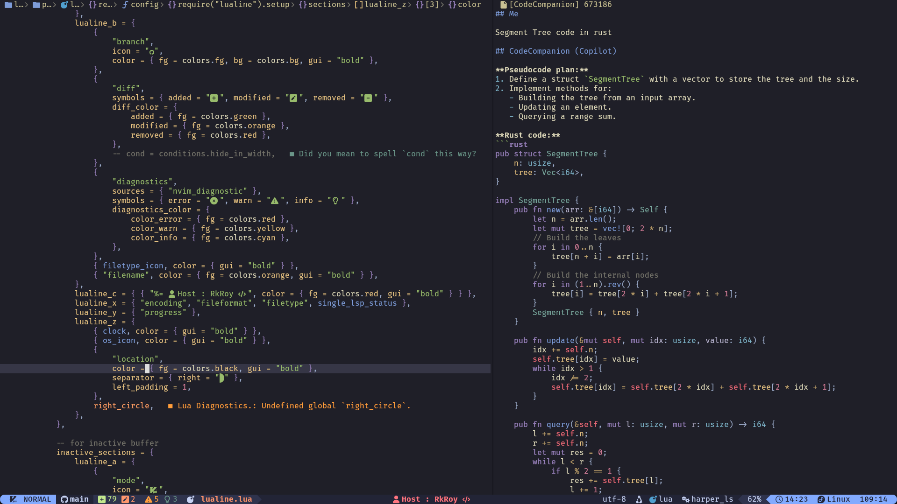
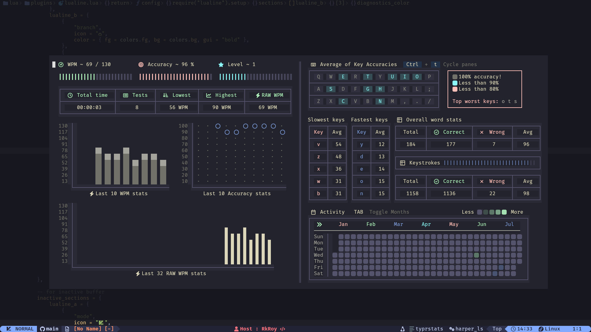
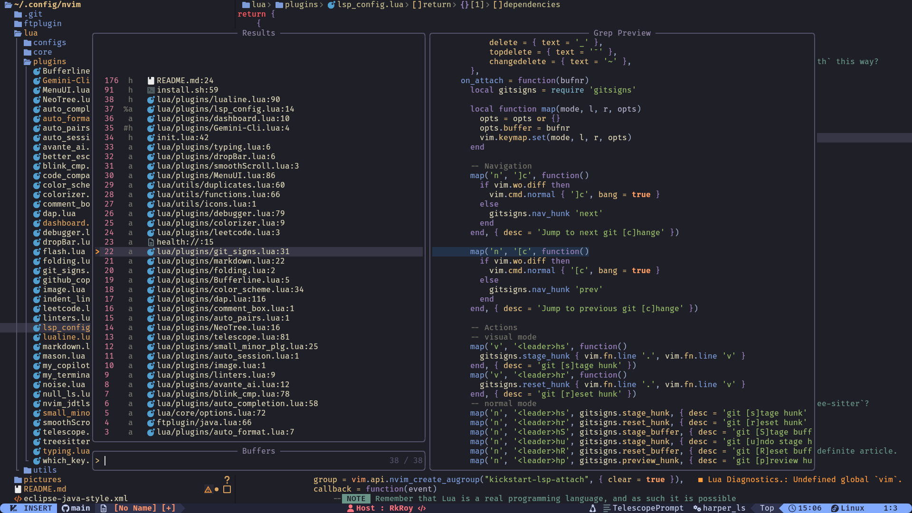

<div align="center">

# 👨‍💻 My Personal Code Engine

</div>

## 🌟 Features

- **🚀 Fast & Lightweight**: Optimized for speed with lazy-loading plugins via `lazy.nvim`.
- **💡 Smart Completion**: Advanced code completion with `nvim-cmp`, powered by multiple sources.
- **💻 Integrated Tooling**: Built-in LSP, linting, formatting, and debugging support.
- **🎨 Beautiful UI**: A clean and modern aesthetic with a custom color scheme, file icons, and status line.
- **🧩 Rich Plugin Ecosystem**: A curated set of plugins for everything from Git integration to project management.
- **⌨️ Intuitive Keymappings**: Sensible and easy-to-remember shortcuts powered by `which-key`.

---

## 📸 Screenshots

|                                                                                                                   |                                                       |
| :---------------------------------------------------------------------------------------------------------------: | :---------------------------------------------------: |
|                                                                                                                   |                                                       |
|  |  |
|                                                               |  |
|                                                               |   |
|                                                                |  |

---

## 📋 Prerequisites

Before you begin, ensure you have the following installed:

- **Neovim v0.8.0+**
- **Git**
- **A Nerd Font** (for icons)

---

## 🚀 Installation

1.  **Clone the repository:**

    ```bash
    git clone https://github.com/RAJ8664/nvim-config.git
    ```

2.  **Run the installation script:**

    ```bash
    cd nvim-config
    chmod +x install.sh
    ./install.sh
    ```

3.  **Start Neovim:**

    Open Neovim and the plugins will be installed automatically.

    ```bash
    nvim
    ```

---

## 🧩 Core Plugins

This configuration is built around a set of powerful plugins:

### Core & UI

| Plugin                | Description                                        |
| :-------------------- | :------------------------------------------------- |
| **`lazy.nvim`**       | The plugin manager that powers this setup.         |
| **`tokyonight.nvim`** | The primary color scheme.                          |
| **`lualine.nvim`**    | A blazing fast and beautiful status line.          |
| **`nvim-tree.lua`**   | A fast and feature-rich file explorer.             |
| **`bufferline.nvim`** | A sleek and functional buffer line.                |
| **`which-key.nvim`**  | A popup that displays keybindings.                 |
| **`telescope.nvim`**  | A highly extendable fuzzy finder.                  |
| **`nvim-treesitter`** | For advanced syntax highlighting and code parsing. |
| **`dashboard-nvim`**  | A fancy start screen for Neovim.                   |

### Development & Tooling

| Plugin               | Description                                          |
| :------------------- | :--------------------------------------------------- |
| **`nvim-lspconfig`** | The core LSP configuration plugin.                   |
| **`mason.nvim`**     | To manage and install LSPs, linters, and formatters. |
| **`nvim-cmp`**       | The completion engine.                               |
| **`nvim-lint`**      | For asynchronous linting.                            |
| **`gitsigns.nvim`**  | Git decorations and hunks in the sign column.        |
| **`nvim-dap`**       | A Debug Adapter Protocol implementation.             |

### Quality of Life

| Plugin                      | Description                                          |
| :-------------------------- | :--------------------------------------------------- |
| **`auto-pairs`**            | Automatically closes pairs of brackets, quotes, etc. |
| **`comment.nvim`**          | For easy commenting and uncommenting of code.        |
| **`indent-blankline.nvim`** | Adds indentation guides.                             |
| **`flash.nvim`**            | For quick navigation within the viewport.            |

---

## 🌐 Language Support

This configuration has built-in support for a variety of languages through `nvim-lspconfig` and `mason.nvim`. The following LSPs are configured by default:

- **`lua_ls`** (Lua)
- **`clangd`** (C/C++)
- **`ts_ls`** (TypeScript/JavaScript)
- **`jdtls`** (Java)
- **`phpactor`** (PHP)
- **`tailwindcss`** (Tailwind CSS)
- **`html`**
- **`sqls`**

You can easily add more LSPs by modifying the `lsp_config.lua` file.

---

## 🎨 Customization

This configuration is designed to be easily customizable. Here are some of the key files you might want to edit:

- **`lua/core/options.lua`**: General Neovim settings.
- **`lua/core/keymaps.lua`**: Global keymappings.
- **`lua/plugins/`**: Plugin configurations. Add or remove files here to manage your plugins.
- **`lua/plugins/lsp_config.lua`**: LSP and language server settings.

---

## 🙏 Credits

This configuration was inspired by the many amazing Neovim users and plugin authors in the community. A special thanks to the creators of the plugins and tools that make this setup possible.

---

<div align="center">

_Made with ❤️ and Lua_

</div>
